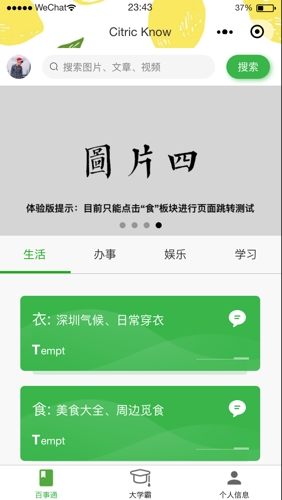
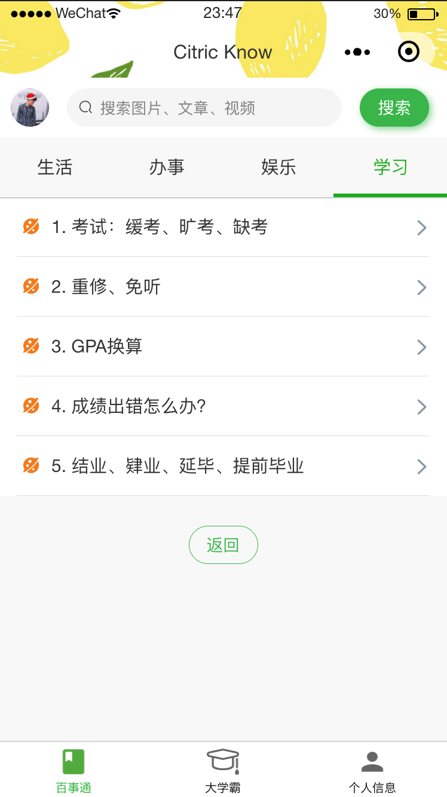
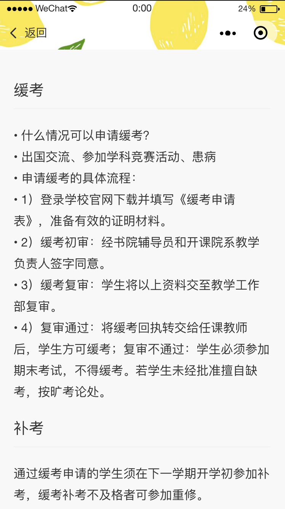
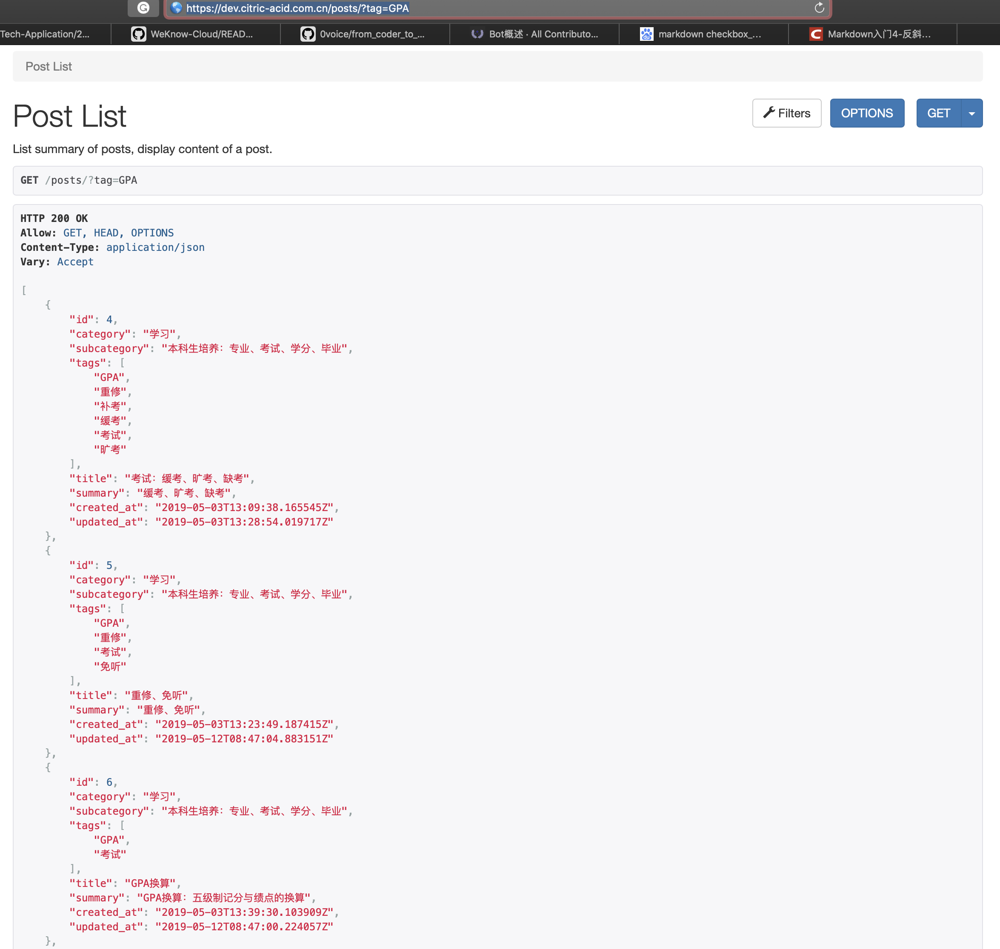
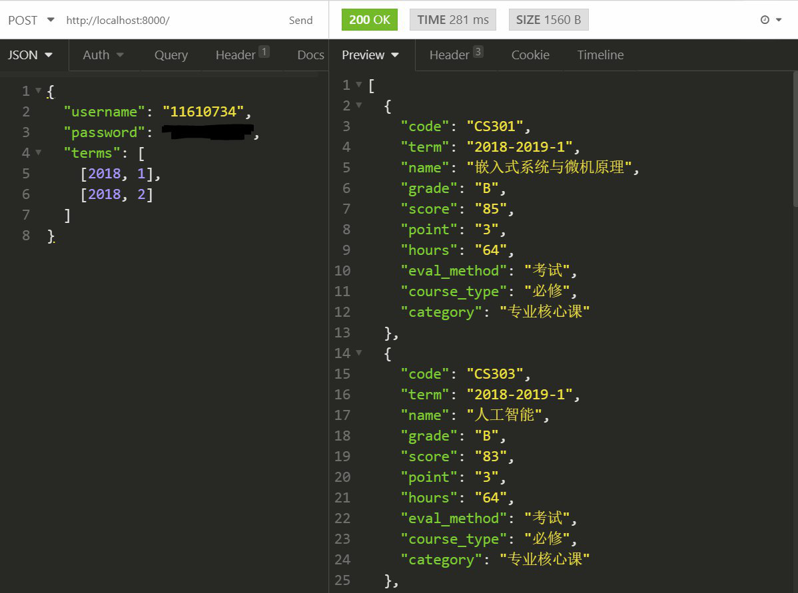

# WeKnow SUSTech

## 简介

本项目致力于向南科学子提供**完全免费的**最全面、最综合以及交互最友好的信息与工具平台。

## 主要功能模块

第一版（2019.9上线）

1. **信息检索**

   1. 信息分类获取

      

          
          
      	   
      

   2. 信息搜索

2. **课程工具**

   1. GPA计算器
   2. 学分计算器与选课推荐

3. **个人信息界面**

   1. 反馈与建议
   2. 个人信息展示
   3. 项目公示

## TODO List

1. **信息类**
  
  - [x] 信息分类
  - [x] 信息展示
    - 使用 `wemark` 对 `markdown` 文档进行渲染显示
  - [ ] 信息搜索
    - [ ] 前端：需要跳转到新的页面
    - [x] 后端：搜索功能暂时由 `tag` 搜索实现
      - API: https://dev.citric-acid.com.cn/posts/?tag=GPA
      - 
  
2. **工具类**

  - [ ] 登录（输入学号密码）
  
    - [ ] 不明文存储密码，考虑实现加密或其他方式
  
  - [ ] **学分计算器（重点）**
  
    - [ ] 设计前端交互（技能点形式👍）
    - [ ] 后端 API 由唐博老师组提供
    - [ ] 设计前端所需 JSON 格式数据，便于后期使用 Adapter Pattern 对 API 进行适配
  
  - [ ] GPA 计算器
  
    - [ ] 前端：可以参考借鉴SUSTC GPA小程序（南科助手），但一定要超过
  
      - [ ] 专业GPA
      - [ ] 学期GPA
      - [ ] 自定义勾选GPA
  
    - [x] 后端API：
  
      
  
3. **个人信息类**

   自由发挥

   1. 反馈与建议
   2. 个人信息展示
   3. 项目公示

## 信息后台

[后台管理](https://dev.citric-acid.com.cn/admin)

账号密码请联系 airine0119@gmail.com

## 开发人员

<!-- ALL-CONTRIBUTORS-LIST:START - Do not remove or modify this section -->
<!-- prettier-ignore -->
<table><tr><td align="center"><a href="https://github.com/Airine"> <b>Aaron</b></a> <a href="https://github.com/Airine/WeKnow-Cloud/commits?author=Airine" title="Code">💻</a></td></tr></table>
<!-- ALL-CONTRIBUTORS-LIST:END -->

## 信息来源

[[1](https://github.com/SUSTech-Application/2019-Fall)] 南科大飞跃手册

